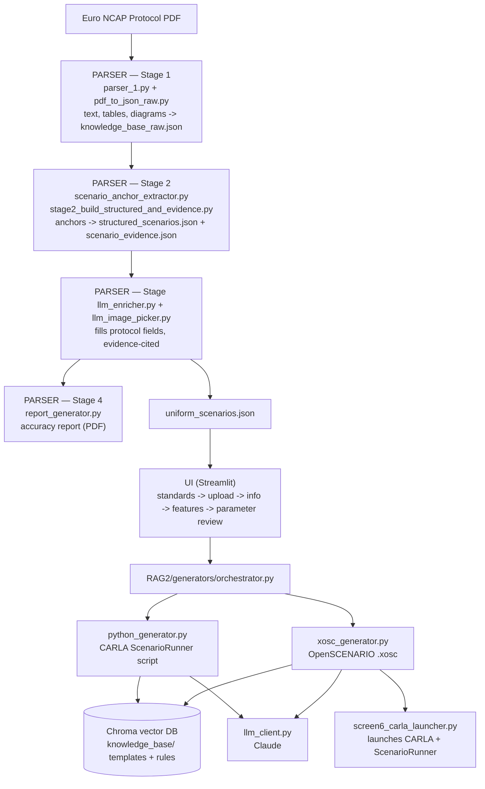

# ADASynAI — ADAS Scenario Generator for CARLA

**ADASynAI** turns a Euro NCAP protocol PDF into ready-to-run CARLA test
scenarios. It reads the protocol, extracts every test scenario it defines,
fills in the parameters an LLM can reliably infer, and generates both a
CARLA Python script and an OpenSCENARIO (`.xosc`) file you can execute
directly in ScenarioRunner — all from a single Streamlit UI.

---

## What it does

The pipeline runs end to end, with no manual scenario authoring required:

1. **Parse** the uploaded Euro NCAP PDF — extract raw text, tables, and diagrams.
2. **Extract** every scenario anchor (code + name) for the AEB, LSS, and VRU families.
3. **Structure** each anchor into a canonical scenario schema, paired with
   the supporting evidence (text + table/diagram images) needed to fill it in.
4. **Enrich** the structured scenarios with an LLM, filling in only the
   fields the protocol actually specifies — every filled value carries a
   citation back to the page and text it came from.
5. **Report** on extraction accuracy — a PDF grading how well each
   scenario was captured, generated automatically alongside parsing.
6. **Generate** artifacts on demand: a CARLA Python (ScenarioRunner) script
   and/or an OpenSCENARIO `.xosc` file, via a RAG pipeline over a Chroma
   knowledge base of templates and rules.
7. **Review & override** — before generation, adjust any protocol field the
   pipeline verified as safely editable (speeds, overlap, headway, actor
   model), with everything else shown read-only for transparency.
8. **Launch** the generated `.xosc` directly in CARLA + ScenarioRunner from
   the UI, with live logs and status.

Supported ADAS families: **AEB** (Car-to-Car) and **VRU** (pedestrian, cyclist, motorcyclist).

---

## Architecture



The pipeline is **evidence-first and null-tolerant** throughout: a field is
only filled if the protocol states it, every filled value is tagged with
the page and text it came from, and nothing in the pipeline hard-fails
just because a field is legitimately absent — it's surfaced as a warning
for the generator or the engineer to handle instead.

---

## Project Structure

```text
clean_euro/
│
├── EuroNcap/                                  # Input PDFs go here
│
├── PARSER/                                    # PDF parsing + scenario extraction
│   ├── Parsed_Data/                           # Extracted text/images (generated at runtime)
│   ├── parser_1.py                            # Stage 1: PDF -> text + images
│   ├── pdf_to_json_raw.py                     # Stage 1: assembles knowledge_base_raw.json
│   ├── scenario_anchor_extractor.py           # Finds scenario anchors (code + name)
│   ├── stage2_build_structured_and_evidence.py# Builds structured scenarios + evidence packs
│   ├── llm_enricher.py                        # Stage 3: LLM fills protocol fields
│   ├── llm_image_picker.py                    # Stage 3: picks the right table images
│   ├── report_generator.py                    # Stage 4: parsing accuracy report (PDF)
│   └── main_parser.py                         # Orchestrates all stages end to end
│
├── RAG2/                                      # LLM + RAG pipeline
│   ├── chroma_ncap_1536/                      # Persistent Chroma vector DB (generated)
│   ├── knowledge_base/                        # Python/XOSC templates + rules (ingested into Chroma)
│   ├── prompts/                                # System/user prompt builders
│   ├── generators/
│   │   ├── orchestrator.py                    # Single entry point: generate both artifacts
│   │   ├── python_generator.py                # CARLA Python generation + AEB validation
│   │   └── xosc_generator.py                  # XOSC generation + AEB/VRU validation
│   ├── config.py                              # Central config (.env, models, Chroma dir, TOP_K)
│   ├── embeddings.py                          # OpenAI embeddings helper
│   ├── chroma_store.py                        # Chroma client, ingestion, retrieval
│   ├── llm_client.py                          # Provider-agnostic OpenAI/Claude JSON calls
│   ├── scenario_utils.py                      # Null-tolerant scenario helpers
│   └── xosc_builder.py                        # Deterministic XOSC fallback (no LLM)
│
├── UI/                                        # Streamlit frontend
│   ├── assets/                                # Logos, background image
│   ├── mainUIlauncher.py                      # Entry point / page router
│   ├── ui_utils.py                            # Session state, navigation, shared helpers
│   ├── parameter_overrides.py                 # Field-driven override logic + XOSC patching
│   ├── screen1_standards.py                   # Step 1: choose standard (Euro NCAP, ...)
│   ├── screen2_upload.py                      # Step 2: upload PDF, run the parser
│   ├── screen3_info.py                        # Step 3: document summary + PDF preview
│   ├── screen4_features.py                    # Step 4: accuracy report + scenario selection
│   ├── screen5_generate.py                    # Step 5: choose scenario + generation target
│   ├── screen5c_parameter_review.py           # Step 5b: review/override extracted parameters
│   ├── screen5a_generate_xosc.py              # Step 6a: generate + download XOSC
│   ├── screen5b_generate_python.py            # Step 6b: generate + download Python
│   └── screen6_carla_launcher.py              # Step 7: launch CARLA + ScenarioRunner
│
├── requirements.txt
└── README.md
```

---

## Prerequisites

- **Linux** (the CARLA launcher screen assumes a Linux shell environment)
- **Python 3.10+**
- **CARLA 0.9.15** installed at `~/CARLA_0.9.15` (only needed for the
  in-app launcher — generation works without it)
- **ScenarioRunner 0.9.16**, cloned as a sibling/known path (see below)
- An API key for at least one LLM provider:
  - `OPENAI_API_KEY` (used for embeddings, and generation if `provider="openai"`)
  - `ANTHROPIC_API_KEY` (used for generation/enrichment if `provider="claude"`,
    and for the parsing accuracy report)

---

## Setup (Linux)

### 1. Clone the repository

```bash
git clone https://github.com/Shamanth650/MASTER_THESIS.git
cd MASTER_THESIS
```

### 2. Create and activate a virtual environment

```bash
python3 -m venv venv
source venv/bin/activate
```

### 3. Clone ScenarioRunner

```bash
git clone https://github.com/carla-simulator/scenario_runner.git ~/scenario_runner
```

> The CARLA launcher screen expects ScenarioRunner at `~/scenario_runner`
> and CARLA at `~/CARLA_0.9.15`. Adjust the paths in
> `UI/screen6_carla_launcher.py` if yours differ.

### 4. Install dependencies

```bash
pip install -r requirements.txt
```

### 5. Configure environment variables

Create a `.env` file at the project root:

```bash
# At least one of these is required
OPENAI_API_KEY=sk-...
ANTHROPIC_API_KEY=sk-ant-...

# Optional overrides — sensible defaults are used if omitted
OPENAI_MODEL=gpt-4o
OPENAI_EMBED_MODEL=text-embedding-3-small
CLAUDE_MODEL=claude-sonnet-4-6
CHROMA_DIR=./RAG2/chroma_ncap_1536
CHROMA_COLLECTION=ncap_code
RAG_TOP_K=6
```

### 6. Run the tool

```bash
streamlit run UI/mainUIlauncher.py
```

Open the URL Streamlit prints (usually `http://localhost:8501`) and walk
through: **Standard → Upload → Info → Features → Parameter Review → Generate → CARLA**.


---

## Maintainer

Shamanth Bandimata Adiga — `shamanth.adiga@ltts.com`
